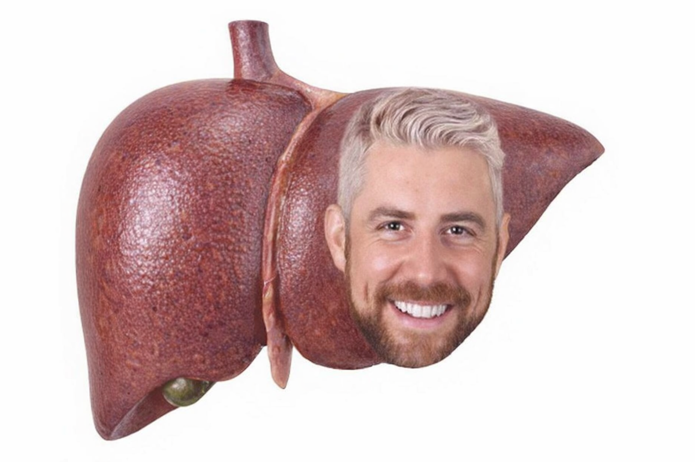
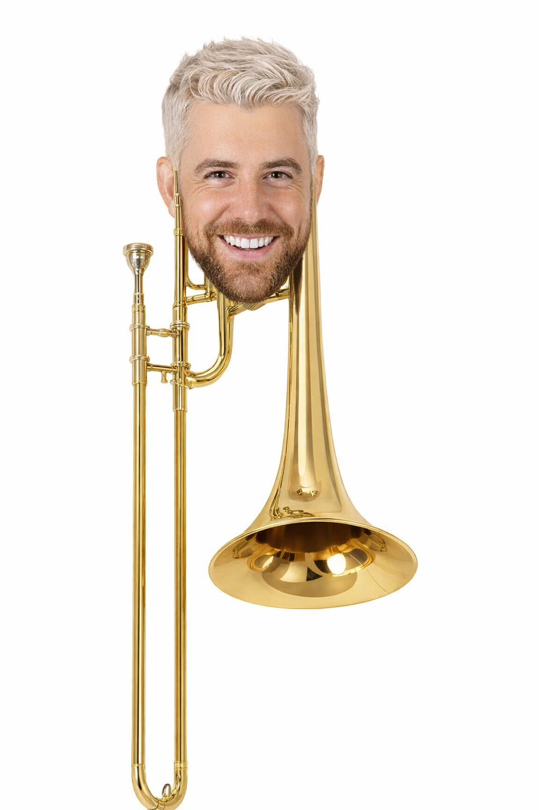

Turns any character into a random object using gpt-image-1.5. 

## Demonstration
Here's an example that shows what the program can output if you use an image of well-known WWE wrestler Joe Hendry.

The results are probably some of the most cursed images of Joe Hendry I have ever seen. If you are allergic to AI slop, or don't want to see your favorite WWE wrestler turn into an object, proceed at your own risk.

_Joe Hendry, except he's a liver_

_Joe Hendry, except he's a trombone_
